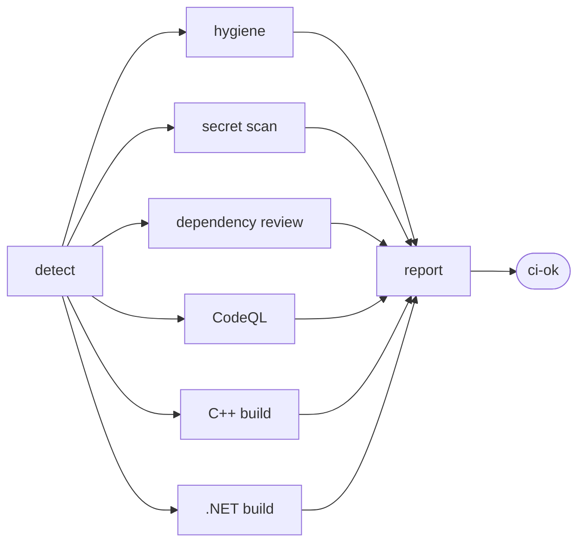

# CI Hub

One CI/CD system for every repository you own — whatever it's written in.

[](https://github.com/arielamzallag2003-beep/ci-hub/actions/workflows/guardrails.yml)
[](https://github.com/arielamzallag2003-beep/ci-hub/actions/workflows/e2e.yml)
[](https://github.com/arielamzallag2003-beep/ci-hub/actions/workflows/self-ci.yml)
[](LICENSE)

---

Instead of a hand-written pipeline in every repository, each project gets a
15-line file that calls this hub. The hub works out what the project is at run
time and runs only what makes sense.

- **Works with any project.** C++, C#, Python, Rust, Node, Gradle, Unity,
  Unreal, Godot, or an empty repository. A stack it cannot build still finishes
  green, with the reason printed — never a red badge for something that isn't
  your fault.
- **Never writes to your repository.** No commits, no tags, no merges, no
  force-pushes. Enforced by a workflow, not by good intentions.
- **Fix it once.** A bug fixed here reaches every repository pinned to `@v1` on
  its next run. No fan-out pull requests.

## Contents

[60-second version](#the-60-second-version) ·
[How it works](#how-it-works) ·
[Quickstart](#quickstart) ·
[Per stack](#what-you-get-per-stack) ·
[Caller file](#the-caller-file) ·
[Workflows](#what-runs-and-when) ·
[Configuration](#configuration) ·
[Repository layout](#repository-layout) ·
[Scripts](#the-scripts) ·
[Guarantees](#guarantees) ·
[Cost](#cost-control) ·
[Protecting the hub](#protecting-the-hub-itself) ·
[Troubleshooting](#troubleshooting) ·
[Versioning](#versioning) ·
[Forking](#using-this-in-your-own-account) ·
[Contributing](#contributing) ·
[Docs](#documentation-map)

## Vocabulary

Four GitHub terms this README uses constantly. If they're already familiar,
skip ahead.

| Term | Meaning here |
| --- | --- |
| **Reusable workflow** | A workflow another repository can call with `uses:`. `ci.yml`, `release.yml` and `security.yml` are the three this hub publishes. |
| **Caller** | The tiny workflow file *in your project* that calls one of them. |
| **Composite action** | A bundle of steps used with `uses:` inside a job. The hub's live in `.github/actions/`. |
| **Job summary** | The rendered report at the bottom of a workflow run page. Where the hub explains what it did and why. |

## The 60-second version

```bash
pwsh ./scripts/bootstrap-repo.ps1 -Repo my-project          # dry run, shows the diff
pwsh ./scripts/bootstrap-repo.ps1 -Repo my-project -Apply   # opens a pull request
```

Merge the pull request. That's the whole adoption. There is no per-language
configuration step.

## How it works



`detect` fingerprints the repository — build systems, engines, analysis
languages — and every other job is conditional on what it found.

Everything funnels into **`ci-ok`**, and that is the only status check you ever
make required in a project. It fails when a job *failed*; a job that was
*skipped* because your project has no C# in it keeps it green. That's what lets
one identical branch-protection rule work across every repository you own,
including the ones CI can't build.

### The jobs, in order

| Job | Runs when | Does |
| --- | --- | --- |
| `Detect` | always | Fingerprints the repo, decides the OS matrix, detects docs-only changes |
| `Hygiene` | always | Oversized files, conflict markers, CRLF in shell scripts, committed build output, missing LICENSE/README |
| `Secret scan` | `run-security` | gitleaks over the working tree |
| `Dependency review` | pull requests only | Blocks PRs adding high-severity CVEs |
| `CodeQL` | a supported language was detected | One run per language |
| `C++` | a CMake or Makefile project was found | Configure, build, test, `clang-format` check |
| `.NET` | a solution or project was found | Restore, build, `dotnet test`, format check |
| `Report` | always | Writes the summary and the single updating PR comment |
| `ci-ok` | always | The gate. Fails only if a needed job *failed* |

## Quickstart

### A new project

1. Create the repository and write some code:
   ```bash
   gh repo create my-project --private --clone && cd my-project
   ```
2. Adopt the hub:
   ```bash
   pwsh /path/to/ci-hub/scripts/bootstrap-repo.ps1 -Repo my-project -Apply
   ```
   *Expected:* a printed list of files to add, then a pull request URL.
3. Merge the pull request and push. *Expected:* a CI run whose summary names
   your stack, e.g. `C++ (cmake) build enabled in '.'`.

### An existing repository

1. See where you stand — this changes nothing:
   ```bash
   pwsh ./scripts/audit-repos.ps1
   ```
   *Expected:* a table of every repository with its workflow count, branch
   protection and secret-scanning status.
2. Adopt one, reviewing the dry run first:
   ```bash
   pwsh ./scripts/bootstrap-repo.ps1 -Repo my-project
   pwsh ./scripts/bootstrap-repo.ps1 -Repo my-project -Apply
   ```
   Existing workflows are never touched or overwritten.
3. Once CI is green, require it:
   ```bash
   pwsh ./scripts/apply-protection.ps1 -Repo my-project -Apply
   ```
   *Expected:* `ci-ok` required, force-pushes and branch deletion blocked.

> **Do not run `apply-protection.ps1` against this hub.** It requires a check
> named `ci-ok`, which is correct for a *project* but wrong here — see
> [Protecting the hub itself](#protecting-the-hub-itself).

## What you get, per stack

| Your project | What runs | Tier |
| --- | --- | --- |
| CMake or Makefile C++ | build, `ctest`/`make test`, `clang-format` check | full build |
| .NET `.sln` / `.slnx` / `.csproj` | restore, build, `dotnet test`, format check | full build |
| Python | CodeQL, hygiene, secret scan | analysis |
| Node | CodeQL, hygiene, secret scan | analysis |
| Rust, Gradle/Kotlin | hygiene, secret scan | hygiene |
| Godot | .NET build if a solution exists, else hygiene | mixed |
| **Unity** | hygiene, secret scan — **build skipped, needs a licence seat** | green |
| **Unreal** | hygiene, secret scan — **build skipped, needs the engine** | green |
| **Empty / unrecognised** | hygiene, secret scan — **stated as such** | green |

The bottom three rows are the point of the design. They pass, and the summary
says exactly why nothing was built.

`clang-format` runs only if the project has a `.clang-format` file — the hub
does not invent a style for you.

## The caller file

Identical in every repository, regardless of language:

```yaml
name: CI
on:
  push: { branches: [main] }
  pull_request:
  workflow_dispatch:
permissions:
  contents: read
concurrency:
  group: ci-${{ github.ref }}
  cancel-in-progress: ${{ github.ref != 'refs/heads/main' }}
jobs:
  ci:
    uses: arielamzallag2003-beep/ci-hub/.github/workflows/ci.yml@v1
    permissions:
      contents: read
      security-events: write # CodeQL
      pull-requests: write # the PR comment
      actions: read
```

The `permissions` block belongs to the caller because a reusable workflow can
only *narrow* permissions, never widen them.

Copies of all three callers live in [`starters/`](starters/):

| File | Copy to | Purpose |
| --- | --- | --- |
| [`starters/ci.yml`](starters/ci.yml) | `.github/workflows/ci.yml` | The above. Every project wants this. |
| [`starters/release.yml`](starters/release.yml) | `.github/workflows/release.yml` | Draft release when you push a `v*.*.*` tag |
| [`starters/security.yml`](starters/security.yml) | `.github/workflows/security.yml` | Weekly full-history scan + Scorecard |
| [`starters/ci-override-example.yml`](starters/ci-override-example.yml) | `.github/ci.yml` | Only when detection guesses wrong |

## What runs, and when

Three workflows are published for your projects to call. Three exist to test the
hub itself and are never called from outside.

| Workflow | For | Triggered by |
| --- | --- | --- |
| [`ci.yml`](.github/workflows/ci.yml) | your projects | Called by a project on push and pull request |
| [`release.yml`](.github/workflows/release.yml) | your projects | Called by a project when **you** push a `v*.*.*` tag |
| [`security.yml`](.github/workflows/security.yml) | your projects | Called by a project on a weekly schedule |
| [`self-ci.yml`](.github/workflows/self-ci.yml) | the hub | Runs `ci.yml` against the hub itself |
| [`e2e.yml`](.github/workflows/e2e.yml) | the hub | Runs `ci.yml` against all five test fixtures and asserts the results |
| [`guardrails.yml`](.github/workflows/guardrails.yml) | the hub | actionlint, zizmor, shellcheck, the safety checks, the detection snapshots |

## Configuration

Inputs to `ci.yml` — all optional:

| Input | Default | Effect |
| --- | --- | --- |
| `os-matrix` | `linux` | `full` adds Windows and macOS. `auto` uses Linux on PRs and escalates on main and tags. |
| `dotnet-version` | `8.0.x` | Ignored when the project has a `global.json`. |
| `cmake-build-type` | `Release` | Passed to `CMAKE_BUILD_TYPE`. |
| `run-security` | `true` | Secret scanning and dependency review. |
| `run-codeql` | `true` | CodeQL for the detected languages. |
| `artifact-retention-days` | `7` | Keeps you clear of the storage quota. |
| `timeout-minutes` | `20` | Per build job. |
| `working-directory` | `.` | For a monorepo whose project isn't at the top level. |
| `override-file` | `.github/ci.yml` | Where to look for the project's override. |

Inputs to `release.yml`:

| Input | Default | Effect |
| --- | --- | --- |
| `draft` | `true` | Create the release as a draft for you to publish |
| `prerelease` | `false` | Mark it a prerelease |
| `os-matrix` | `full` | Release binaries usually want every platform |
| `dotnet-version`, `cmake-build-type`, `working-directory` | as above | |

When detection gets it wrong, commit `.github/ci.yml` in the project:

```yaml
os-matrix: full
stacks:
  cpp:
    enabled: false # the only CMakeLists.txt here is a vendored dependency
  dotnet:
    project: plugin/MyTool.csproj # pin the right one
```

Anything you leave out stays auto-detected. Full reference:
[docs/OVERRIDES.md](docs/OVERRIDES.md).

## Repository layout

Everything in this repository, and what it is for.

### The reusable workflows and the actions behind them

| Path | What it is |
| --- | --- |
| [`.github/workflows/ci.yml`](.github/workflows/ci.yml) | The entrypoint every project calls, and the `ci-ok` gate |
| [`.github/workflows/release.yml`](.github/workflows/release.yml) | The only workflow with write access, scoped to creating a Release |
| [`.github/workflows/security.yml`](.github/workflows/security.yml) | Weekly full-history secret scan and OpenSSF Scorecard |
| [`.github/actions/detect-stack/`](.github/actions/detect-stack/) | The fingerprinting brain. `detect.sh` does the work; `parse_override.py` reads a project's `.github/ci.yml` without needing PyYAML |
| [`.github/actions/cpp-build/`](.github/actions/cpp-build/) | CMake and Makefile builds, ccache, `clang-format` check |
| [`.github/actions/dotnet-build/`](.github/actions/dotnet-build/) | Restore, build, test with TRX output, `dotnet format --verify-no-changes` |
| [`.github/actions/report/`](.github/actions/report/) | Renders the job summary and the sticky PR comment |

### Helper scripts the workflows call

| Path | What it is |
| --- | --- |
| [`.github/scripts/hygiene.sh`](.github/scripts/hygiene.sh) | The hygiene checks. Errors block; warnings never do |
| [`.github/scripts/gitleaks.sh`](.github/scripts/gitleaks.sh) | Downloads a **checksum-verified** pinned gitleaks and scans |
| [`.github/scripts/summary-detect.sh`](.github/scripts/summary-detect.sh) | Writes the *Detected* section of the summary |
| [`.github/scripts/collect-artifacts.sh`](.github/scripts/collect-artifacts.sh) | Gathers release binaries. Best-effort: nothing to ship is not a failure |
| [`.github/scripts/release-notes.sh`](.github/scripts/release-notes.sh) | Changelog since the previous tag, plus `SHA256SUMS` |
| [`.github/scripts/guardrails.sh`](.github/scripts/guardrails.sh) | The five safety checks. Excluded from its own scans, since it contains the patterns it searches for |

### Testing the hub

| Path | What it is |
| --- | --- |
| [`tests/run-detect-tests.sh`](tests/run-detect-tests.sh) | 16 snapshot assertions on detection |
| `tests/fixtures/cpp-cmake/` | A CMake project that builds and passes `ctest` |
| `tests/fixtures/cpp-make/` | Makefile-only, with a vendored `_tparty/CMakeLists.txt` that must be ignored |
| `tests/fixtures/dotnet/` | A solution with a real xUnit test project |
| `tests/fixtures/unity-like/` | Generated `.csproj` under `obj/` and `Build~/`, and a Unity `package.json`. **Must not** look buildable |
| `tests/fixtures/empty/` | No build system. **Must** finish green |

### Repository housekeeping

| Path | What it is |
| --- | --- |
| [`.github/dependabot.yml`](.github/dependabot.yml) | Weekly action-bump PRs. Since actions are SHA-pinned, this is how you learn a pin is stale |
| [`.github/CODEOWNERS`](.github/CODEOWNERS) | Every change here affects every dependent project, so all changes get reviewed |
| [`.github/pull_request_template.md`](.github/pull_request_template.md) | The pre-merge checklist |
| [`.github/ISSUE_TEMPLATE/detection-wrong.md`](.github/ISSUE_TEMPLATE/detection-wrong.md) | For reporting a misclassified project |
| [`.gitattributes`](.gitattributes) | Forces LF on `.sh`, `.yml`, `.py`. A shell script checked out with CRLF fails on Linux with `\r: command not found` |
| [`.editorconfig`](.editorconfig) | Indentation and line endings per file type |
| [`.gitignore`](.gitignore) | Build output — with a deliberate exception so the `unity-like` fixture keeps its generated `obj/` files |
| [`SECURITY.md`](SECURITY.md) | How to report a vulnerability |

## The scripts

Four PowerShell helpers you run yourself. **All are read-only or dry-run by
default**; the two that change anything require `-Apply`.

| Script | Default behaviour | With `-Apply` |
| --- | --- | --- |
| [`audit-repos.ps1`](scripts/audit-repos.ps1) | Read-only survey of every repo: workflows, branch protection, secret scanning. **Has no `-Apply`** | — |
| [`bootstrap-repo.ps1`](scripts/bootstrap-repo.ps1) | Prints the exact files it would add, and their contents | Creates a branch and opens a pull request. Never pushes to the default branch, never overwrites an existing file |
| [`apply-protection.ps1`](scripts/apply-protection.ps1) | Prints the ruleset it would apply | Applies it: require PR, require `ci-ok`, block force-push and deletion |
| [`pin-actions.ps1`](scripts/pin-actions.ps1) | Re-resolves every action's version comment to a SHA and reports drift | Rewrites the pins in place for you to review as a diff |

Useful flags: `bootstrap-repo.ps1 -WithRelease -WithSecurity` also installs the
release and weekly-security callers. All scripts take `-Owner` if you are
operating on another account.

## Guarantees

Each of these is checked by
[`guardrails.yml`](.github/workflows/guardrails.yml) on every change to the
hub. If one stops being true, the hub's own CI goes red.

| The hub will never… | Enforced by |
| --- | --- |
| commit, tag, push, or force-push to your repository | grep for `git push`/`commit`/`tag`/`--force` across all hub code |
| reformat your code | `clang-format`/`dotnet format` run in check mode; violations become an annotation and a downloadable `format.patch` |
| merge anything | no `contents: write` outside `release.yml`, verified |
| use `pull_request_target` | grep; it is the standard fork-token exfiltration vector |
| run an action from a mutable tag | every third-party action pinned to a full commit SHA |
| require a secret | `ci.yml` declares none, so fork PRs have nothing to leak |
| create a release tag | `release.yml` only *reads* the tag you pushed |

The one exception is deliberate: when **you** push a `v*.*.*` tag,
`release.yml` builds artifacts and creates a **draft** release for you to
publish. It still creates no tag and makes no commit.

### Why formatting produces a patch instead of a commit

A bot that reformats your code is a bot that writes to your repository, and
once it can do that the guarantee above is gone. So formatters run in check
mode, the diff they *would* have made is uploaded as a `format.patch`
artifact, and you apply it yourself:

```bash
git apply format.patch
```

## Cost control

Actions minutes are free on public repositories and metered on private ones,
where Windows costs 2× and macOS 10× a Linux minute. Defaults are chosen
accordingly:

- **Linux only** unless you ask for `full`.
- **Concurrency cancellation** on PR branches, so a force-push doesn't leave
  three stale runs burning minutes.
- **Docs-only pull requests skip the build jobs** entirely (~30 seconds).
- **`timeout-minutes` on every job**, so a hung job can't eat six hours.
- **Caching** for ccache and NuGet.
- **`fail-fast: false`**, so one run reports every broken platform instead of
  making you pay for a second.

More detail: [docs/COST.md](docs/COST.md).

## Protecting the hub itself

Projects require a single check called `ci-ok`. **The hub is the exception**,
because its own checks come from three workflows rather than one call. Create a
branch ruleset (Settings → Rules → Rulesets → New branch ruleset):

| Setting | Value |
| --- | --- |
| Name | `main` |
| Enforcement | **Active** — it does nothing while Disabled |
| Bypass list | empty; anyone listed is exempt from the *whole* ruleset |
| Target | Include default branch |
| Restrict deletions | on |
| Block force pushes | on |
| Require status checks | on, source **GitHub Actions** |
| **Require a pull request** | **on**, with required approvals **0** — see below |
| Require branches up to date | **off** — it forces a rebase and full re-run on every Dependabot merge |

The five required checks, typed exactly:

```
Safety guarantees
Workflow lint
Detection snapshot tests
Assert fixture classifications
ci / ci-ok
```

Three traps, each of which produces a `main` you cannot merge into:

- **Status checks without the pull-request rule make the branch permanently
  unmergeable.** Without it, GitHub evaluates the *commit the merge would
  produce* — which is brand new and has no checks recorded against it — rather
  than the pull request's. Every merge method fails, even with all five checks
  green. The two rules only work together.
- **Never require a check whose name contains `${{ ... }}`.** GitHub's picker
  offers entries like `ci / C++ (${{ matrix.os }})` — that is the name recorded
  for a *skipped* job. When the job actually runs the name resolves to
  `ci / C++ (ubuntu-latest)`, so the literal version never reports and merges
  hang pending forever.
- **Set required approvals to 0.** GitHub does not let you approve your own
  pull request, so any higher number makes a solo repository unmergeable.

Together these mean direct pushes to `main` stop working. Work becomes: branch
→ push → pull request → merge when green. That is the intended trade: a broken
`main` here reaches every project the moment the `v1` tag moves.

If you would rather keep pushing directly, the coherent alternative is to drop
**both** the status-check and pull-request rules and keep only Restrict
deletions and Block force pushes. You still get the protection that matters
against losing work. What does not work is status checks on their own.

The ruleset targets **branches only**, so moving the `v1` tag still works.

## Troubleshooting

**My stack was detected wrong.**
Read the *Detected* section of the run summary — it states every decision and
why. Then commit a `.github/ci.yml` override
([reference](docs/OVERRIDES.md)) to correct it.

**CI is red and I can't tell why.**
Open the `ci-ok` job. It names the jobs that actually failed, as opposed to the
ones that were skipped.

**A required check is stuck pending and I can't merge.**
You almost certainly required a check name containing `${{ matrix... }}`.
Remove it from the ruleset and add the resolved name instead.

**I want Windows and macOS builds.**
Set `os-matrix: full` — in the caller's `with:` block for always, or in the
project's `.github/ci.yml` to make it the project's own default.

**How do I skip CI for a documentation change?**
You don't need to. A pull request touching only `*.md`, `docs/`, `LICENSE` or
`.gitignore` skips the build jobs automatically and stays green.

**The formatting job failed but I don't want to reformat by hand.**
Download the `format-patch-cpp` or `format-patch-dotnet` artifact from the run
and `git apply format.patch`.

**Hygiene warns about committed build artifacts.**
It is a warning, never a failure, and nothing is deleted. Add the paths to
`.gitignore` and `git rm --cached` them when convenient.

## Versioning

Projects pin `@v1`. Releases are tagged `v1.x.y` and the `v1` tag is moved to
the newest of them, so bug fixes arrive without any change on your side.
Anything that would break existing callers goes to `v2`; `v1` keeps working
until you choose to move. To opt out of moving tags entirely, pin a commit SHA
instead — see [docs/SECURITY.md](docs/SECURITY.md).

## Using this in your own account

This hub refers to itself by name, so a fork needs those references repointed
at your copy. Replace `arielamzallag2003-beep/ci-hub` with `<you>/ci-hub` in:

| File | What to change |
| --- | --- |
| `.github/workflows/ci.yml` | the `HUB_REPO` environment variable |
| `.github/workflows/release.yml` | the `HUB_REPO` environment variable |
| `.github/workflows/security.yml` | the `repository:` of the hub checkout |
| `starters/ci.yml`, `starters/release.yml`, `starters/security.yml` | the `uses:` line |
| `.github/CODEOWNERS` | your username |
| `README.md` | the badge URLs |

`HUB_REPO` matters most: leave it and every project that adopts *your* fork
will silently check out and run *this* repository's code instead of yours.

Then tag your own `v1.0.0`, move `v1` to it, and confirm `guardrails.yml`,
`self-ci.yml` and `e2e.yml` are green before pointing any project at it.

## Contributing

Run the same checks CI runs, before pushing:

```bash
bash tests/run-detect-tests.sh        # 16 detection snapshots
bash .github/scripts/guardrails.sh    # the five safety guarantees
```

For the full suite locally you also need three tools CI installs itself —
[actionlint](https://github.com/rhysd/actionlint),
[shellcheck](https://github.com/koalaman/shellcheck) and
[zizmor](https://github.com/woodruffw/zizmor):

```bash
actionlint -ignore 'property "job_workflow_sha" is not defined'
shellcheck -S warning .github/scripts/*.sh .github/actions/*/*.sh tests/*.sh
zizmor --persona=regular .github/workflows/
```

`actionlint` runs shellcheck over every `run:` block, but only if shellcheck is
on your `PATH` — without it those findings are silently skipped.

Then push a branch. `guardrails.yml`, `self-ci.yml` and `e2e.yml` run the real
`ci.yml` against the fixtures in [`tests/fixtures/`](tests/fixtures/), including
the `empty` and `unity-like` cases that must finish green. Do not tag a release
while any of the three is red.

If you change detection, add a snapshot assertion for the case you fixed —
otherwise the next change can silently undo it.

## Documentation map

| Document | Read it for |
| --- | --- |
| [docs/ONBOARDING.md](docs/ONBOARDING.md) | Worked examples: a new C++ project, a new .NET project, a Unity project, adopting existing repositories, shipping a release |
| [docs/OVERRIDES.md](docs/OVERRIDES.md) | Every `.github/ci.yml` key, the parser's limits, and when you actually need one |
| [docs/COST.md](docs/COST.md) | The minutes model, caching, and rough per-run costs |
| [docs/SECURITY.md](docs/SECURITY.md) | Threat model, pinning policy, fork-PR behaviour, permissions table |
| [docs/ARCHITECTURE.md](docs/ARCHITECTURE.md) | Why hub-and-callers, why `ci-ok`, why the hub checks itself out, and the real repository layouts that shaped detection |
